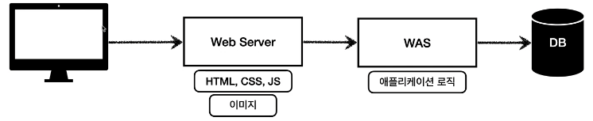
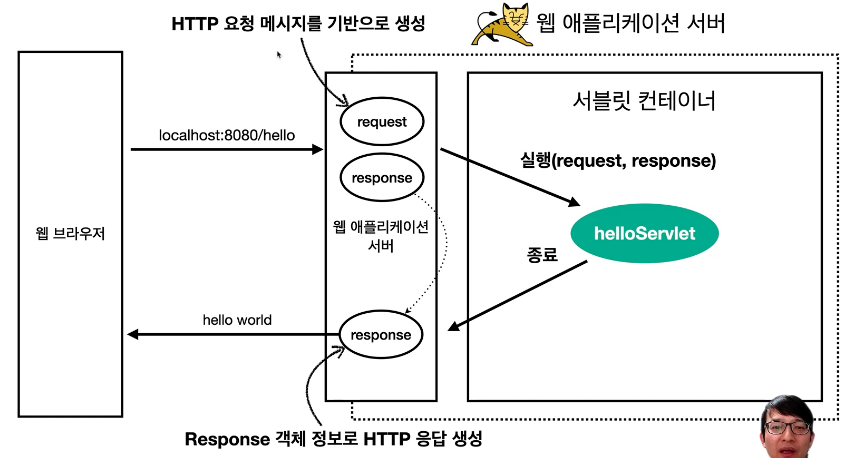

# Section 1. 웹 서버, 웹 애플리케이션 서버

### 모든 것이 HTTP

> HTTP 메시지에 모든 것을 전송한다.

- HTML, TEXT
- IMAGE, 음성, 영상, 파일
- JSON, XML (API)
- 거의 모든 형태의 데이터 전송 가능
- 서버간에 데이터를 주고 받을 때도 대부분 HTTP 사용
- 지금은 HTTP 시대!


### 웹 서버(Web Server)

- HTTP 기반으로 동작
- 정적(파일) HTML, CSS, JS, 이미지, 영상
- 예) NGINX, APACHE


### 웹 애플리케이션 서버(WAS - Web Application Server)

- HTTP 기반으로 동작
- 웹 서버 기능 포함한 그 이상의 것 (정적 리소스도 제공 가능)
- 프로그램 코드를 실행해서 애플리케이션 로직 수행
  - 동적 HTML, HTTP API(JSON)
  - 서블릿, JSP, 스프링 MVC
- 예) Tomcat, Jetty, Undertow


### 웹 서버, 웹 애플리케이션 서버(WAS) 차이

- 웹 서버는 정적 리소스(파일), WAS는 애플리케이션 로직
- 사실은 둘의 용어도 경계도 모호함
  - 웹 서버도 프로그램을 실행하는 기능을 포함하기도 함
  - 웹 애플리케이션 서버도 웹 서버의 기능을 제공함
- 자바는 서블릿 컨테이너 기능을 제공하면 WAS
  - 서블릿 없이 자바코드를 실행하는 서버 프레임워크도 있음
- WAS는 애플리케이션 코드를 실행하는데 더 특화


### 웹 시스템 구성 - WAS, DB

- WAS, DB 만으로 시스템 구성 가능
- WAS는 정적 리소스, 애플리케이션 로직 모두 제공 가능

- WAS가 너무 많은 역할을 담당, 서버 과부하 우려
- 가장 비싼 애플리케이션 로직이 정적 리소스 때문에 수행이 어려울 수 있음
- WAS 장애시 오류 화면도 노출 불가능


### 웹 시스템 구성 - WEB, WAS, DB (일반적)

- 정적 리소스는 웹 서버가 처리
- 웹 서버는 애플리케이션 로직 같은 동적인 처리가 필요하면 WAS에 요청을 위임
- WAS는 중요한 애플리케이션 로직 처리 전담



- 효율적인 리소스 관리
  - 정적 리소스가 많이 사용되면 Web 서버 증설
  - 애플리케이션 리소스가 많이 사용되면 WAS 증설
- 정적 리소스만 제공하는 웹 서버는 잘 죽지 않음
- 애플리케이션 로직이 동작하는 WAS 서버는 잘 죽음
- WAS, DB 장애시 WEB 서버가 오류 화면 제공 가능


## 서블릿

 직접 서버를 구현할 경우 아래를 다 직접 구현해야 하지만, 서블릿은 **비즈니스 로직을 제외한 모든 것들을 다 알아서 처리해준다.** 그리고 이 서블릿을 WAS가 지원한다.

- 서버 TCP/IP 대기, 소켓 연결
- HTTP 요청 메시지를 파싱해서 읽기
- POST 방식, /save URL 인지
- Content-Type 확인
- HTTP 메시지 바디 내용 파싱
- 저장 프로세스 실행
- 비즈니스 로직 실행
  - 데이터베이스에 저장 요청
- HTTP 응답 메시지 생성 시작
  - HTTP 시작 라인 생성
  - Header 생성
  - 메시지 바디에 HTML 생성에서 입력
- TCP/IP에 응답 전달, 소켓 종료


### 특징

``` java
@WebServlet(name = "helloSErvlet", urlPatterns = "/hello")
public class Helloservlet extends HttpServlet {
  
  @Override
  protected void service(HttpServletRequest request, HttpServletResponse response) {
    // 애플리케이션 로직
  }
}
```

- urlPatterns(/hello) 의 URL이 호출되면 서블릿 코드가 실행
- HTTP 요청 정보를 편리하게 사용할 수 있는 HttpServletRequest
- HTTP 응답 정보를 편리하게 제공할 수 있는 HttpServletResponse
- 개발자는 HTTP 스펙을 매우 편리하게 사용


### 서블릿 HTTP 요청, 응답 흐름



1. HTTP 요청시 WAS는 Request, Response 객체를 새로 만들어서 서블릿 객체 호출
2. 개발자는 Request 객체에서 HTTP 요청 정보를 편리하게 꺼내서 사용
3. 개발자는 Response 객체에 HTTP 응답 정보를 편리하게 입력
4. WAS는 Response 객체에 담겨있는 내용으로 HTTP 응답 정보를 생성


### 서블릿 컨테이너

> 서블릿을 생성, 호출, 관리 등 서블릿의 생명주기를 관리해주는 주체

- 톰캣처럼 서블릿을 지원하는 WAS를 서블릿 컨테이너라고 함
- 서블릿 컨테이너는 서블릿 객체를 생성, 초기화, 호출, 종료하는 생명주기 관리
- 서블릿 객체는 싱글톤으로 관리
  - 고객의 요청이 올 때마다 계속 객체를 생성하는 것은 비효율
  - 최초 로딩 시점에 서블릿 객체를 미리 만들어두고 재활용
  - 모든 고객 요청은 동일한 서블릿 객체 인스턴스에 접근
  - 공유 변수 사용 주의
  - 서블릿 컨테이너 종료시 함께 종료
- JSP도 서블릿으로 변환 되어서 사용
- **동시 요청을 위한 멀티 쓰레드 처리 지원 => 가장 큰 특징이라고 함**


