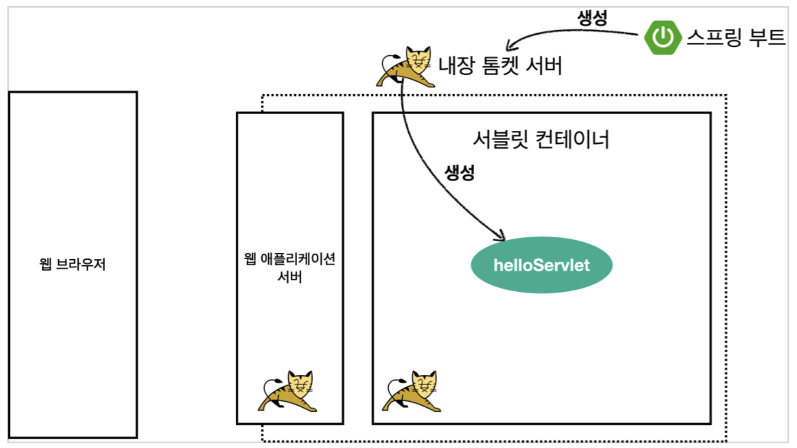
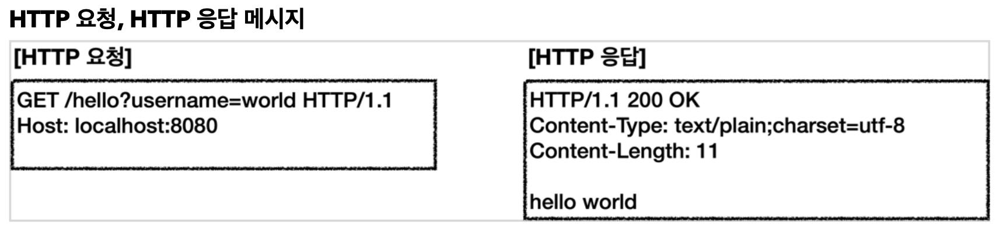
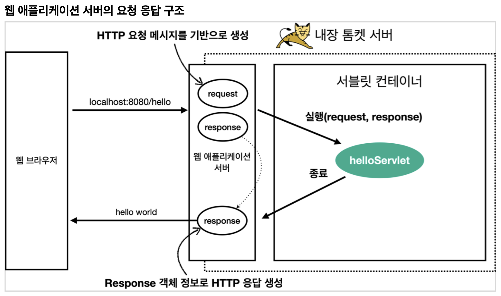

# Section 2. 서블릿

### 프로젝트 생성

- packaging 을 War 로 해야 JSP가 돌아감


## Hello 서블릿

스프링 부트 환경에서 서블릿을 등록하고 사용해보자.

> 참고: 서블릿은 톰캣 같은 웹 애플리케이션 서버를 직접 설치하고, 그 위에 서블릿 코드를 클래스 파일로 빌드해서 올린 다음, 톰캣 서버를 실행하면 된다. 하지만 이 과정은 매우 번거롭다. 스프링 부트는 톰캣 서버를 내장하고 있으므로, 톰캣 서버 설치 없이 편리하게 서블릿 코드를 실행할 수 있다.


### 스프링 부트 서블릿 환경 구성

- `@ServletComponentScan`: 스프링부트는 서블릿을 직접 등록해서 사용할 수 있도록 `@ServletComponentScan` 을 지원한다.

``` java
package hello.servlet;

import org.springframework.boot.SpringApplication;
import org.springframework.boot.autoconfigure.SpringBootApplication;
import org.springframework.boot.web.servlet.ServletComponentScan;

@ServletComponentScan // 서블릿 자동 등록
@SpringBootApplication
public class ServletApplication {

	public static void main(String[] args) {
		SpringApplication.run(ServletApplication.class, args);
	}
}
```


### 서블릿 등록하기

``` java
package hello.servlet.basic;

import java.io.IOException;
import javax.servlet.ServletException;
import javax.servlet.annotation.WebServlet;
import javax.servlet.http.HttpServlet;
import javax.servlet.http.HttpServletRequest;
import javax.servlet.http.HttpServletResponse;

@WebServlet(name = "helloServlet", urlPatterns = "/hello")
public class HelloServlet extends HttpServlet {

    @Override
    protected void service(HttpServletRequest request, HttpServletResponse response)
            throws ServletException, IOException {
        System.out.println("HelloServlet.service");
        System.out.println("request = " + request);
        System.out.println("response = " + response);

        String username = request.getParameter("username");
        System.out.println("username = " + username);

        response.setContentType("text/plain"); // http header에 들어감
        response.setCharacterEncoding("utf-8"); // http header에 들어감
        response.getWriter().write("hello " + username); // http body에 들어감
    }
}
```

- `@WebServlet` 서블릿 애노테이션

  - name: 서블릿 이름
  - urlPatterns: URL 매핑

- HTTP 요청을 통해 매핑된 URL이 호출되면 서블릿 컨테이너는 다음 메서드를 실행한다.

  `protected void service(HttpServletRequest request, HttpServletResponse response)`

- 웹 브라우저 실행

  - `http://localhost:8080/hello?username=world`
  - 결과: hello world

- 콘솔 실행 결과

  ```
  HelloServlet.service
  request = org.apache.catalina.connector.RequestFacade@5e4e72
  response = org.apache.catalina.connector.ResponseFacade@37d112b6
  username = world
  ```

> [주의]
>
> Intellij 무료 버전을 사용하는데, 서버가 정상 실행되지 않는다면 프로젝트 생성 -> Intellij Gradle 대신에 자바 직접 실행에 있는 주의 사항을 읽어보자.


### HTTP 요청 메시지 로그로 확인하기

- application.properties 내 아래를 추가한다.

  - `logging.level.org.apache.coyote.http11=debug`

- 서버를 다시 시작하고, 요청해보면 서버가 받은 HTTP 요청 메시지를 출력하는 것을 확인할 수 있다.

  ```
  ...o.a.coyote.http11.Http11InputBuffer: Received [GET /hello?username=servlet
  HTTP/1.1
  Host: localhost:8080
  Connection: keep-alive
  Cache-Control: max-age=0
  sec-ch-ua: "Chromium";v="88", "Google Chrome";v="88", ";Not A Brand";v="99"
  sec-ch-ua-mobile: ?0
  Upgrade-Insecure-Requests: 1
  User-Agent: Mozilla/5.0 (Macintosh; Intel Mac OS X 11_2_1) AppleWebKit/537.36
  (KHTML, like Gecko) Chrome/88.0.4324.150 Safari/537.36
  Accept: text/html,application/xhtml+xml,application/xml;q=0.9,image/avif,image/
  webp,image/apng,*/*;q=0.8,application/signed-exchange;v=b3;q=0.9
  Sec-Fetch-Site: same-origin
  Sec-Fetch-Mode: navigate
  Sec-Fetch-User: ?1
  Sec-Fetch-Dest: document
  Referer: http://localhost:8080/basic.html
  Accept-Encoding: gzip, deflate, br
  Accept-Language: ko,en-US;q=0.9,en;q=0.8,ko-KR;q=0.7
  ]
  ```

> [참고]
>
> 운영 서버에 이렇게 모든 요청 정보를 다 남기면 성능 저하가 발생할 수 있다. 개발 단계에서만 적용할 것


### 서블릿 컨테이너 동작 방식

- 내장 톰캣 서버 생성

  

- HTTP 요청, HTTP 응답 메시지

  

- 웹 애플리케이션 서버의 요청 응답 구조

  

> [참고]
>
> HTTP 응답에서 Content-Length는 웹 애플리케이션 서버가 자동은로 생성해준다.


### welcome 페이지 추가

지금부터 개발할 내용을 편리하게 참고할 수 있도록 welcome 페이지를 만들어둔다.

`webapp` 경로에 `index.html`을 두면 루트(http://localhost:8080) 호출시 index.html 페이지가 열린다.

- main/webapp/index.html

  ``` html
  <!DOCTYPE html>
  <html>
  <head>
      <meta charset="UTF-8">
      <title>Title</title>
  </head>
  
  <body>
  <ul>
      <li><a href="basic.html">서블릿 basic</a></li>
  </ul>
  </body>
  </html>
  ```

- main/webapp/basic.html : 이번 장에서 학습할 내용은 다음 basic.html 이다.

  ``` html
  <!DOCTYPE html>
  <html>
  <head>
      <meta charset="UTF-8">
      <title>Title</title>
  </head>
  <body> <ul>
      <li>hello 서블릿
          <ul>
              <li><a href="/hello?username=servlet">hello 서블릿 호출</a></li>
          </ul> </li>
      <li>HttpServletRequest
          <ul>
              <li><a href="/request-header">기본 사용법, Header 조회</a></li> <li>HTTP 요청 메시지 바디 조회
              <ul>
                  <li><a href="/request-param?username=hello&age=20">GET - 쿼리 파라미터</a></li>
                  <li><a href="/basic/hello-form.html">POST - HTML Form</a></li>
                  <li>HTTP API - MessageBody -> Postman 테스트</li> </ul>
          </li> </ul>
      </li>
      <li>HttpServletResponse
          <ul>
              <li><a href="/response-header">기본 사용법, Header 조회</a></li> <li>HTTP 응답 메시지 바디 조회
              <ul>
                  <li><a href="/response-html">HTML 응답</a></li>
                  <li><a href="/response-json">HTTP API JSON 응답</a></li>
              </ul> </li>
          </ul> </li>
  </ul>
  </body>
  </html>
  ```
  


## HttpServletRequest 개요

### HttpServletRequest 역할

HTTP 요청 메시지를 개발자가 직접 파싱해서 사용해도 되지만, 매우 불편할 것이다. 서블릿은 개발자가 HTTP 요청 메시지를 편리하게 사용할 수 있도록 개발자 대신에 HTTP 요청 메시지를 파싱한다. 그리고 그 결과를 `HttpServletRequest` 객체에 담아서 제공한다.

HttpServletRequest 를 사용하면 다음과 같은 HTTP 요청 메시지를 편리하게 조회할 수 있다.

``` http
POST /save HTTP/1.1
Host: localhost:8080
Content-Type: application/x-www-form-urlencoded

username=kim&age=20
```

- START LINE
  - HTTP 메소드
  - URL
  - 쿼리 스트링
  - 스키마, 프로토콜
- 헤더
  - 헤더 조회
- 바디
  - form 파라미터 형식 조회
  - message body 데이터 직접 조회


HttpServletRequest 객체는 추가로 여러가지 부가 기능도 함께 제공한다.

- 임시 저장소 기능
  - 해당 HTTP 요청이 시작부터 끝날 때까지 유지되는 임시 저장소 기능
    - 저장: `request.setAttribute(name, value)`
    - 조회: `request.getAttribute(name)`
- 세션 관리 기능
  - `request.getSession(create: true)`

> [중요]
>
> HttpServletRequest, HttpServletResponse 를 사용할 때 가장 중요한 점은 이 객체들이 HTTP 요청 메시지, HTTP 응답 메시지를 편리하게 사용하도록 도와주는 객체라는 점이다. 따라서 이 기능에 대해서 깊이있는 이해를 하려면 HTTP 스펙이 제공하는 요청, 응답 메시지 자체를 이해해야 한다.


## HttpServletRequest - 기본 사용법

``` java
package hello.servlet.basic.request;

import java.io.IOException;
import javax.servlet.ServletException;
import javax.servlet.annotation.WebServlet;
import javax.servlet.http.Cookie;
import javax.servlet.http.HttpServlet;
import javax.servlet.http.HttpServletRequest;
import javax.servlet.http.HttpServletResponse;

@WebServlet(name = "requestHeaderServlet", urlPatterns = "/request-header")
public class RequestHeaderServlet extends HttpServlet {

    @Override
    protected void service(HttpServletRequest req, HttpServletResponse resp) throws ServletException, IOException {
        printStartLine(req);
        printHeaders(req);
        printHeaderUtils(req);
        printEtc(req);
    }

    // start line 정보
    private void printStartLine(HttpServletRequest request) {
        System.out.println("-- REQUEST-LINE - start ---");

        System.out.println("request.getMethod() = " + request.getMethod());
        System.out.println("request.getProtocol() = " + request.getProtocol()); // HTTP/1.1
        System.out.println("request.getScheme() = " + request.getScheme()); // http
        System.out.println("request.getRequestURL() = " + request.getRequestURL());
        System.out.println("request.getRequestURI() = " + request.getRequestURI());
        System.out.println("request.getQueryString() = " + request.getQueryString());
        System.out.println("request.isSecure() = " + request.isSecure()); // https 사용유무
        System.out.println("--- REQUEST-LINE - end ---");
        System.out.println();
    }

    private void printHeaders(HttpServletRequest request) {
        System.out.println("--- Headers - start ---");

        // 옛날 방식
        // Enumeration<String> headerNames = request.getHeaderNames();
        // while (headerNames.hasMoreElements()) {
        //    String headerName = headerNames.nextElement();
        //    System.out.println(headerName + ": " + request.getHeader(headerName));
        // }

        request.getHeaderNames().asIterator()
                .forEachRemaining(headerName ->
                        System.out.println(headerName + ": " + request.getHeader(headerName)));
        System.out.println("--- Headers - end ---");
        System.out.println();
    }

    private void printHeaderUtils(HttpServletRequest request) {
        System.out.println("--- Header 편의 조회 start ---");
        System.out.println("[Host 편의 조회]");
        System.out.println("request.getServerName() = " + request.getServerName()); // Host 헤더
        System.out.println("request.getServerPort() = " + request.getServerPort()); // Host 헤더
        System.out.println();

        System.out.println("[Accept-Language 편의 조회]");
        request.getLocales().asIterator()
                .forEachRemaining(locale ->
                        System.out.println("locale = " + locale));
        System.out.println("request.getLocale() = " + request.getLocale());
        System.out.println();

        System.out.println("[cookie 편의 조회]");
        if (request.getCookies() != null) {
            for (Cookie cookie : request.getCookies()) {
                System.out.println(cookie.getName() + ": " + cookie.getValue());
            }
        }
        System.out.println();

        System.out.println("[Content 편의 조회]");
        System.out.println("request.getContentType() = " + request.getContentType());
        System.out.println("request.getContentLength() = " + request.getContentLength());
        System.out.println("request.getCharacterEncoding() = " + request.getCharacterEncoding());
        System.out.println("--- Header 편의 조회 end ---");

    }

    // 기타 정보는 HTTP 메시지의 정보는 아니다.
    private void printEtc(HttpServletRequest request) {
        System.out.println("--- 기타 조회 start ---");

        System.out.println("[Remote 정보]");
        System.out.println("request.getRemoteHost() = " + request.getRemoteHost());
        System.out.println("request.getRemoteAddr() = " + request.getRemoteAddr());
        System.out.println("request.getRemotePort() = " + request.getRemotePort());
        System.out.println();

        System.out.println("[Local 정보]");
        System.out.println("request.getLocalName() = " + request.getLocalName());
        System.out.println("request.getLocalAddr() = " + request.getLocalAddr());
        System.out.println("request.getLocalPort() = " + request.getLocalPort());

        System.out.println("--- 기타 조회 end ---");
        System.out.println();
    }
}
```

```
-- REQUEST-LINE - start ---
request.getMethod() = GET
request.getProtocol() = HTTP/1.1
request.getScheme() = http
request.getRequestURL() = http://localhost:8080/request-header
request.getRequestURI() = /request-header
request.getQueryString() = null
request.isSecure() = false
--- REQUEST-LINE - end ---

--- Headers - start ---
host: localhost:8080
connection: keep-alive
cache-control: max-age=0
sec-ch-ua: "Google Chrome";v="107", "Chromium";v="107", "Not=A?Brand";v="24"
sec-ch-ua-mobile: ?0
sec-ch-ua-platform: "macOS"
upgrade-insecure-requests: 1
user-agent: Mozilla/5.0 (Macintosh; Intel Mac OS X 10_15_7) AppleWebKit/537.36 (KHTML, like Gecko) Chrome/107.0.0.0 Safari/537.36
accept: text/html,application/xhtml+xml,application/xml;q=0.9,image/avif,image/webp,image/apng,*/*;q=0.8,application/signed-exchange;v=b3;q=0.9
sec-fetch-site: none
sec-fetch-mode: navigate
sec-fetch-user: ?1
sec-fetch-dest: document
accept-encoding: gzip, deflate, br
accept-language: ko,en-US;q=0.9,en;q=0.8,ko-KR;q=0.7
cookie: Idea-98a03908=32de70b2-efc0-4f09-b264-5c8ae684ae0b
--- Headers - end ---

--- Header 편의 조회 start ---
[Host 편의 조회]
request.getServerName() = localhost
request.getServerPort() = 8080

[Accept-Language 편의 조회]
locale = ko
locale = en_US
locale = en
locale = ko_KR
request.getLocale() = ko

[cookie 편의 조회]
Idea-98a03908: 32de70b2-efc0-4f09-b264-5c8ae684ae0b

[Content 편의 조회]
request.getContentType() = null
request.getContentLength() = -1
request.getCharacterEncoding() = UTF-8
--- Header 편의 조회 end ---
--- 기타 조회 start ---
[Remote 정보]
request.getRemoteHost() = 0:0:0:0:0:0:0:1
request.getRemoteAddr() = 0:0:0:0:0:0:0:1
request.getRemotePort() = 49771

[Local 정보]
request.getLocalName() = localhost
request.getLocalAddr() = 0:0:0:0:0:0:0:1
request.getLocalPort() = 8080
--- 기타 조회 end ---
```

> [참고]
>
> 로컬에서 테스트하면 IPv6 정보가 나오는데, IPv4 정보를 보고 싶으면 다음 옵션을 VM options에 넣어주면 된다.
> `-Djava.net.preferIPv4Stack=true`


## HTTP 요청 데이터 - 개요

주로 다음 3가지 방법을 사용해서 서버로 데이터를 전달한다.

1. GET - 쿼리 파라미터

   - `url?username=hello&age=20`
   - 메시지 바디 없이, URL의 쿼리 파라미터에 데이터를 포함해서 전달
   - 예) 검색, 필터, 페이징 등에서 많이 사용하는 방식

2. POST - HTML Form

   - content-type: application/x-www-form-urlencoded
   - 메시지 바디에 쿼리 파라미터 형식으로 전달 username=hello&age20
   - 예) 회원 가입, 상품 주문, HTML Form 사용

3. HTTP message body에 데이터를 직접 담아서 요청

   - HTTP API에서 주로 사용, JSON, XML, TEXT

   - 데이터 형식은 주로 JSON을 사용 
   - POST, PUT, PATCH 등의 HTTP METHOD에서 사용한다.


## HTTP 요청 데이터 - GET 쿼리 파라미터

다음 데이터를 클라이언트에서 서버로 전송해보자.

- username=hello
- age=20

메시지 바디 없이, URL의 쿼리 파라미터를 사용해서 데이터를 전달하자. => 검색, 필터, 페이징 등에서 많이 사용하는 방식

쿼리 파라미터는 URL에 다음과 같이 `?` 를 시작으로 보낼 수 있다. 추가 파라미터는 `&` 로 구분하면 된다.

- http://localhost:8080/request-param?username=hello&age

서버에서는 `HttpServletRequest` 가 제공하는 다음 메서드를 통해 쿼리 파라미터를 편리하게 조회할 수 있다.


### 쿼리 파라미터 조회 메서드

``` java
String username = request.getParameter("username"); // 단일 파라미터 조회
Enumeration<String> parameterNames = request.getParameterNames(); // 파라미터 이름들 모두 조회
Map<String, String[]> parameterMap = request.getParameterMap(); // 파라미터를 Map으로 조회
String[] usernames = request.getParameterValues("username"); // 복수 파라미터 조회
```


- **RequestParamServlet**

  ``` java
  package hello.servlet.basic.request;
  
  import java.io.IOException;
  import java.util.Enumeration;
  import javax.servlet.ServletException;
  import javax.servlet.annotation.WebServlet;
  import javax.servlet.http.HttpServlet;
  import javax.servlet.http.HttpServletRequest;
  import javax.servlet.http.HttpServletResponse;
  
  /**
   * 1. 파라미터 전송 기능 http://localhost:8080/request-param?username=hello&age=20
   * <p>
   * 2. 동일한 파리멑 전송 가능 http://localhost:8080/request-param?username=hello&username=kim&age=20
   */
  @WebServlet(name = "requestParamServlet", urlPatterns = "/request-param")
  public class RequestParamServlet extends HttpServlet {
  
      @Override
      protected void service(HttpServletRequest req, HttpServletResponse resp) throws ServletException, IOException {
          System.out.println("[전체 파라미터 조회] - start");
          /*Enumeration<String> parameterNames = req.getParameterNames();
          while (parameterNames.hasMoreElements()) {
              String paramName = parameterNames.nextElement();
              System.out.println("paramName = " + req.getParameter(paramName));
          }*/
  
          req.getParameterNames().asIterator()
                  .forEachRemaining(paramName -> System.out
                          .println("paramName = " + req.getParameter(paramName)));
  
          System.out.println("[전체 파라미터 조회] - end");
          System.out.println();
  
          System.out.println("[단일 파라미터 조회]");
          String username = req.getParameter("username");
          System.out.println("req.getParameter(username) = " + username);
          
          String age = req.getParameter("age");
          System.out.println("req.getParameter(age) = " + age);
          System.out.println();
  
          System.out.println("[이름이 같은 복수 파라미터 조회]");
          System.out.println("req.getParameterValues(username)");
          String[] usernames = req.getParameterValues("username");
          for (String name : usernames) {
              System.out.println("username=" + name);
          }
  
          resp.getWriter().write("ok");
      }
  }
  ```

  - 실행 - 파라미터 전송: http://localhost:8080/request-param?username=hello&age=20

- 결과

  ```
  [전체 파라미터 조회] - start
  username=hello
  age=20
  [전체 파라미터 조회] - end
  
  [단일 파라미터 조회] 
  req.getParameter(username) = hello 
  req.getParameter(age) = 20
  
  [이름이 같은 복수 파라미터 조회] 
  req.getParameterValues(username)
  username=hello
  ```

  - 실행 - 동일 파라미터 전송: http://localhost:8080/request-param?username=hello&username=kim&age=20

- 결과

  ```
  [전체 파라미터 조회] - start 
  username=hello
  age=20
  [전체 파라미터 조회] - end
  
  [단일 파라미터 조회] 
  request.getParameter(username) = hello 
  request.getParameter(age) = 20
  
  [이름이 같은 복수 파라미터 조회] 
  request.getParameterValues(username) 
  username=hello
  username=kim
  ```

- 복수 파라미터에서 단일 파라미터 조회

  - `username=hello&username=kim` 과 같이 파라미터 이름은 하나인데, 값이 중복이면 어떻게 될까? `request.getParameter()` 는 하나의 파라미터 이름에 대해서 단 하나의 값만 있을 때 사용해야 한다. 지금처럼 중복일 때는 `request.getParameterValues()` 를 사용해야 한다. 참고로 이렇게 중복일 때 request.getParameter() 를 사용하면 request.getParameterValues()의 첫번째 값을 반환한다.


