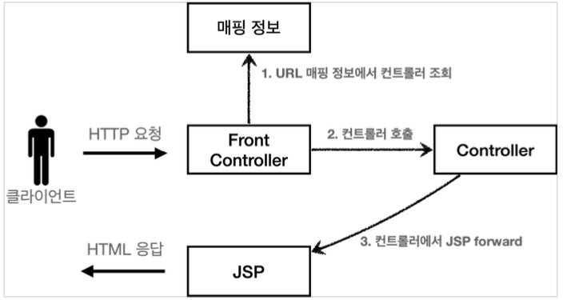

# Section 4. MVC 프레임워크 만들기

## 프론트 컨트롤러 패턴 소개

### 프론트 컨트롤러 도입 전


### 프론트 컨트롤러 도입 후


### FrontController 패턴 특징

- 프론트 컨트롤러 서블릿 하나로 클라이언트의 요청을 받음
- 프론트 컨트롤러가 요청에 맞는 컨트롤러를 찾아서 호출
- 입구를 하나로!
- 공통 처리 가능
- 프론트 컨트롤러를 제외한 나머지 컨트롤러는 서블릿을 사용하지 않아도 됨

**스프링 웹 MV의 핵심도 바로 FrontController, 스프링 웹 MVC의 Dispatcherservlet이 FrontController 패턴으로 구현되어 있음**


## 프론트 컨트롤러 도입 - v1

이번 목표는 기존 코드를 최대한 유지하면서, 프론트 컨트롤러를 도입하는 것이다. 먼저 구조를 맞추어두고 점진적으로 리팩토링 해보자.


### v1 구조




### ControllerV1

``` java
package hello.servlet.web.frontcontroller.v1;

import java.io.IOException;
import javax.servlet.ServletException;
import javax.servlet.http.HttpServletRequest;
import javax.servlet.http.HttpServletResponse;

public interface ControllerV1 {
    void process(HttpServletRequest request, HttpServletResponse response) 
            throws ServletException, IOException;
}
```

서블릿과 비슷한 모양의 컨트롤러 인터페이스를 도입한다. 각 컨트롤러들은 이 인터페이스를 구현하면 된다. 프론트 컨트롤러는 이 인터페이스를 호출해서 구현과 관계없이 로직의 일관성을 가져갈 수 있다.

이제 이 인터페이스를 구현한 컨트롤러를 만들어보자. 지금 단계에서는 기존 로직을 최대한 유지하는게 핵심이다.


### MemberFormControllerV1 - 회원 등록 컨트롤러

``` java
package hello.servlet.web.frontcontroller.v1.controller;

import hello.servlet.web.frontcontroller.v1.ControllerV1;
import java.io.IOException;
import javax.servlet.RequestDispatcher;
import javax.servlet.ServletException;
import javax.servlet.http.HttpServletRequest;
import javax.servlet.http.HttpServletResponse;

public class MemberFormControllerV1 implements ControllerV1 {

    @Override
    public void process(HttpServletRequest request, HttpServletResponse response)
            throws ServletException, IOException {

        String viewPath = "/WEB-INF/views/new-form.jsp";
        RequestDispatcher dispatcher = request.getRequestDispatcher(viewPath);
        dispatcher.forward(request, response);
    }
}
```


### MemberSaveControllerV1 - 회원 저장 컨트롤러

``` java
package hello.servlet.web.frontcontroller.v1.controller;

import hello.servlet.domain.member.Member;
import hello.servlet.domain.member.MemberRepository;
import hello.servlet.web.frontcontroller.v1.ControllerV1;
import java.io.IOException;
import javax.servlet.RequestDispatcher;
import javax.servlet.ServletException;
import javax.servlet.http.HttpServletRequest;
import javax.servlet.http.HttpServletResponse;

public class MemberSaveControllerV1 implements ControllerV1 {

    private MemberRepository memberRepository = MemberRepository.getInstance();

    @Override
    public void process(HttpServletRequest request, HttpServletResponse response)
            throws ServletException, IOException {

        String username = request.getParameter("username");
        int age = Integer.parseInt(request.getParameter("age"));

        Member member = new Member(username, age);
        memberRepository.save(member);

        request.setAttribute("member", member);

        String viewPath = "/WEB-INF/views/save-result.jsp";
        RequestDispatcher dispatcher = request.getRequestDispatcher(viewPath);
        dispatcher.forward(request, response);
    }
}
```


### MemberListControllerV1 - 회원 목록 컨트롤러

``` java
package hello.servlet.web.frontcontroller.v1.controller;

import hello.servlet.domain.member.Member;
import hello.servlet.domain.member.MemberRepository;
import hello.servlet.web.frontcontroller.v1.ControllerV1;
import java.io.IOException;
import java.util.List;
import javax.servlet.RequestDispatcher;
import javax.servlet.ServletException;
import javax.servlet.http.HttpServletRequest;
import javax.servlet.http.HttpServletResponse;

public class MemberListControllerV1 implements ControllerV1 {

    private MemberRepository memberRepository = MemberRepository.getInstance();

    @Override
    public void process(HttpServletRequest request, HttpServletResponse response)
            throws ServletException, IOException {

        List<Member> members = memberRepository.findAll();
        request.setAttribute("members", members);

        String viewPath = "/WEB-INF/views/members.jsp";
        RequestDispatcher dispatcher = request.getRequestDispatcher(viewPath);
        dispatcher.forward(request, response);
    }
}
```


### FrontControllerServletV1 - 프론트 컨트롤러

``` java
package hello.servlet.web.frontcontroller.v1;

import hello.servlet.web.frontcontroller.v1.controller.MemberFormControllerV1;
import hello.servlet.web.frontcontroller.v1.controller.MemberListControllerV1;
import hello.servlet.web.frontcontroller.v1.controller.MemberSaveControllerV1;
import java.io.IOException;
import java.util.HashMap;
import java.util.Map;
import javax.servlet.ServletException;
import javax.servlet.annotation.WebServlet;
import javax.servlet.http.HttpServlet;
import javax.servlet.http.HttpServletRequest;
import javax.servlet.http.HttpServletResponse;

@WebServlet(name = "frontControllerServletV1", urlPatterns = "/front-controller/v1/*")
public class FrontControllerServletV1 extends HttpServlet {
    private Map<String, ControllerV1> controllerV1Map = new HashMap<>();

    public FrontControllerServletV1() {
        controllerV1Map.put("/front-controller/v1/members/new-form", new MemberFormControllerV1());
        controllerV1Map.put("/front-controller/v1/members/save", new MemberSaveControllerV1());
        controllerV1Map.put("/front-controller/v1/members/", new MemberListControllerV1());
    }

    @Override
    protected void service(HttpServletRequest request, HttpServletResponse response)
            throws ServletException, IOException {
        System.out.println("FrontControllerServletV1.service");
        String requestURI = request.getRequestURI(); // URL에서 host+port 까지를 뺸 나머지 뒷 부분을 얻어올 수 있음

        ControllerV1 controller = controllerV1Map.get(requestURI);
        if (controller == null) {
            response.setStatus(HttpServletResponse.SC_NOT_FOUND);
            return;
        }

        controller.process(request, response);
    }
}
```

- `urlPatterns = "/front-controller/v1/*"`: /front-controller/v1 를 포함한 하위 모든 요청은 이 서블릿에서 받아 들인다.

- controllerMap
  - key: 매핑 URL
  - value: 호출될 컨트롤러

- service()
  - 먼저 `requestURI` 를 조회해서 실제 호출할 컨트롤러를 controllerMap 에서 찾는다. 만약 없다면 404(SC_NOT_FOUND) 상태 코드를 반환한다.
  - 컨트롤러를 찾고 `controller.process(request, response)` 을 호출해서 해당 컨트롤러를 실행한다.
- JSP: 이전 MVC에서 사용했던 것을 그대로 사용한다.

- 실행
  - 등록: http://localhost:8080/front-controller/v1/members/new-form
  - 목록: http://localhost:8080/front-controller/v1/members

- 실무 TIP
  - 구조를 개선할 때는 기존 코드를 최대한 유지 시키는 것이 낫다.
  - 구조를 개선하고 문제가 없다고 판단이 되었을 때 코드를 개선한다.
  - 즉, 단계적으로 같은 레벨에 있는 것들만 묶어서 개선 작업을 진행하는 것이 낫다.


