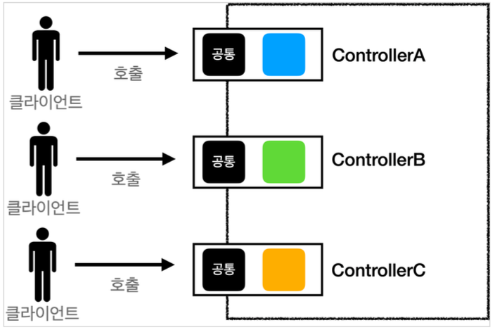
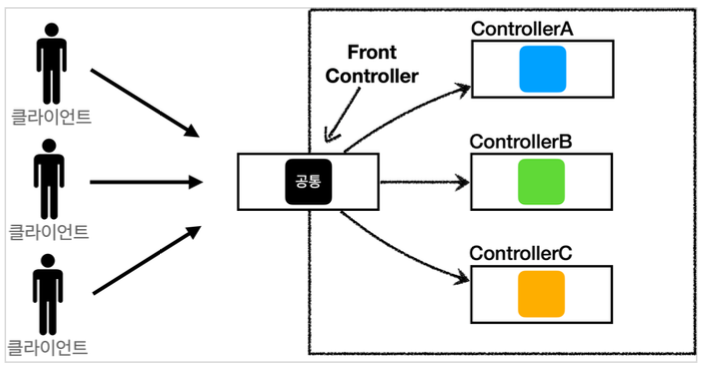

# Section 4. MVC 프레임워크 만들기

## 프론트 컨트롤러 패턴 소개

### 프론트 컨트롤러 도입 전

### 프론트 컨트롤러 도입 후

### FrontController 패턴 특징

- 프론트 컨트롤러 서블릿 하나로 클라이언트의 요청을 받음
- 프론트 컨트롤러가 요청에 맞는 컨트롤러를 찾아서 호출
- 입구를 하나로!
- 공통 기능 처리 가능
- 프론트 컨트롤러를 제외한 나머지 컨트롤러는 서블릿을 사용하지 않아도 됨

**스프링 웹 MV의 핵심도 바로 FrontController, 스프링 웹 MVC의 Dispatcherservlet이 FrontController 패턴으로 구현되어 있음**

