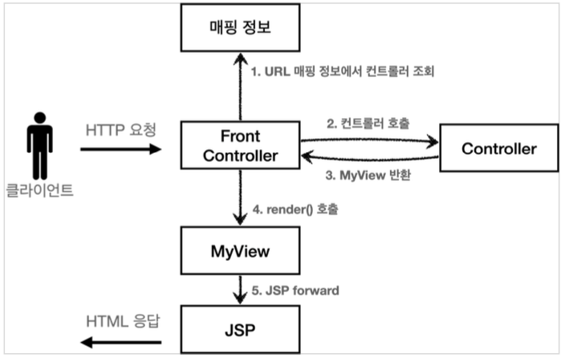
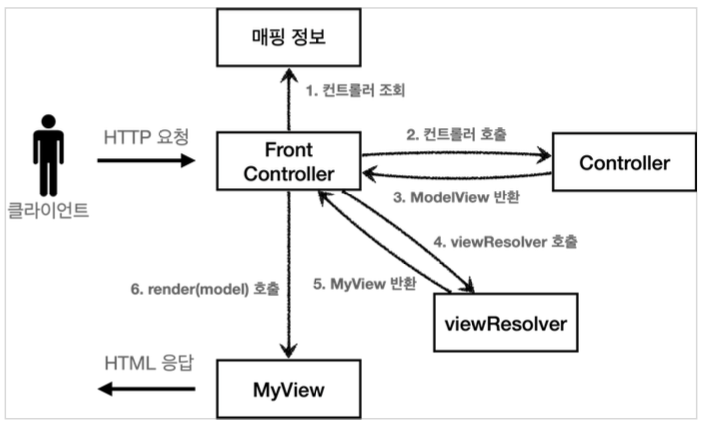

# Section 4. MVC 프레임워크 만들기

## 프론트 컨트롤러 패턴 소개

### 프론트 컨트롤러 도입 전


### 프론트 컨트롤러 도입 후


### FrontController 패턴 특징

- 프론트 컨트롤러 서블릿 하나로 클라이언트의 요청을 받음
- 프론트 컨트롤러가 요청에 맞는 컨트롤러를 찾아서 호출
- 입구를 하나로!
- 공통 처리 가능
- 프론트 컨트롤러를 제외한 나머지 컨트롤러는 서블릿을 사용하지 않아도 됨

**스프링 웹 MV의 핵심도 바로 FrontController, 스프링 웹 MVC의 Dispatcherservlet이 FrontController 패턴으로 구현되어 있음**


## 프론트 컨트롤러 도입 - v1

이번 목표는 기존 코드를 최대한 유지하면서, 프론트 컨트롤러를 도입하는 것이다. 먼저 구조를 맞추어두고 점진적으로 리팩토링 해보자.


### v1 구조


### ControllerV1

``` java
package hello.servlet.web.frontcontroller.v1;

import java.io.IOException;
import javax.servlet.ServletException;
import javax.servlet.http.HttpServletRequest;
import javax.servlet.http.HttpServletResponse;

public interface ControllerV1 {
    void process(HttpServletRequest request, HttpServletResponse response) 
            throws ServletException, IOException;
}
```

서블릿과 비슷한 모양의 컨트롤러 인터페이스를 도입한다. 각 컨트롤러들은 이 인터페이스를 구현하면 된다. 프론트 컨트롤러는 이 인터페이스를 호출해서 구현과 관계없이 로직의 일관성을 가져갈 수 있다.

이제 이 인터페이스를 구현한 컨트롤러를 만들어보자. 지금 단계에서는 기존 로직을 최대한 유지하는게 핵심이다.


### MemberFormControllerV1 - 회원 등록 컨트롤러

``` java
package hello.servlet.web.frontcontroller.v1.controller;

import hello.servlet.web.frontcontroller.v1.ControllerV1;
import java.io.IOException;
import javax.servlet.RequestDispatcher;
import javax.servlet.ServletException;
import javax.servlet.http.HttpServletRequest;
import javax.servlet.http.HttpServletResponse;

public class MemberFormControllerV1 implements ControllerV1 {

    @Override
    public void process(HttpServletRequest request, HttpServletResponse response)
            throws ServletException, IOException {

        String viewPath = "/WEB-INF/views/new-form.jsp";
        RequestDispatcher dispatcher = request.getRequestDispatcher(viewPath);
        dispatcher.forward(request, response);
    }
}
```


### MemberSaveControllerV1 - 회원 저장 컨트롤러

``` java
package hello.servlet.web.frontcontroller.v1.controller;

import hello.servlet.domain.member.Member;
import hello.servlet.domain.member.MemberRepository;
import hello.servlet.web.frontcontroller.v1.ControllerV1;
import java.io.IOException;
import javax.servlet.RequestDispatcher;
import javax.servlet.ServletException;
import javax.servlet.http.HttpServletRequest;
import javax.servlet.http.HttpServletResponse;

public class MemberSaveControllerV1 implements ControllerV1 {

    private MemberRepository memberRepository = MemberRepository.getInstance();

    @Override
    public void process(HttpServletRequest request, HttpServletResponse response)
            throws ServletException, IOException {

        String username = request.getParameter("username");
        int age = Integer.parseInt(request.getParameter("age"));

        Member member = new Member(username, age);
        memberRepository.save(member);

        request.setAttribute("member", member);

        String viewPath = "/WEB-INF/views/save-result.jsp";
        RequestDispatcher dispatcher = request.getRequestDispatcher(viewPath);
        dispatcher.forward(request, response);
    }
}
```


### MemberListControllerV1 - 회원 목록 컨트롤러

``` java
package hello.servlet.web.frontcontroller.v1.controller;

import hello.servlet.domain.member.Member;
import hello.servlet.domain.member.MemberRepository;
import hello.servlet.web.frontcontroller.v1.ControllerV1;
import java.io.IOException;
import java.util.List;
import javax.servlet.RequestDispatcher;
import javax.servlet.ServletException;
import javax.servlet.http.HttpServletRequest;
import javax.servlet.http.HttpServletResponse;

public class MemberListControllerV1 implements ControllerV1 {

    private MemberRepository memberRepository = MemberRepository.getInstance();

    @Override
    public void process(HttpServletRequest request, HttpServletResponse response)
            throws ServletException, IOException {

        List<Member> members = memberRepository.findAll();
        request.setAttribute("members", members);

        String viewPath = "/WEB-INF/views/members.jsp";
        RequestDispatcher dispatcher = request.getRequestDispatcher(viewPath);
        dispatcher.forward(request, response);
    }
}
```


### FrontControllerServletV1 - 프론트 컨트롤러

``` java
package hello.servlet.web.frontcontroller.v1;

import hello.servlet.web.frontcontroller.v1.controller.MemberFormControllerV1;
import hello.servlet.web.frontcontroller.v1.controller.MemberListControllerV1;
import hello.servlet.web.frontcontroller.v1.controller.MemberSaveControllerV1;
import java.io.IOException;
import java.util.HashMap;
import java.util.Map;
import javax.servlet.ServletException;
import javax.servlet.annotation.WebServlet;
import javax.servlet.http.HttpServlet;
import javax.servlet.http.HttpServletRequest;
import javax.servlet.http.HttpServletResponse;

@WebServlet(name = "frontControllerServletV1", urlPatterns = "/front-controller/v1/*")
public class FrontControllerServletV1 extends HttpServlet {
    private Map<String, ControllerV1> controllerV1Map = new HashMap<>();

    public FrontControllerServletV1() {
        controllerV1Map.put("/front-controller/v1/members/new-form", new MemberFormControllerV1());
        controllerV1Map.put("/front-controller/v1/members/save", new MemberSaveControllerV1());
        controllerV1Map.put("/front-controller/v1/members/", new MemberListControllerV1());
    }

    @Override
    protected void service(HttpServletRequest request, HttpServletResponse response)
            throws ServletException, IOException {
        System.out.println("FrontControllerServletV1.service");
        String requestURI = request.getRequestURI(); // URL에서 host+port 까지를 뺸 나머지 뒷 부분을 얻어올 수 있음

        ControllerV1 controller = controllerV1Map.get(requestURI);
        if (controller == null) {
            response.setStatus(HttpServletResponse.SC_NOT_FOUND);
            return;
        }

        controller.process(request, response);
    }
}
```

- `urlPatterns = "/front-controller/v1/*"`: /front-controller/v1 를 포함한 하위 모든 요청은 이 서블릿에서 받아 들인다.

- controllerMap
  - key: 매핑 URL
  - value: 호출될 컨트롤러

- service()
  - 먼저 `requestURI` 를 조회해서 실제 호출할 컨트롤러를 controllerMap 에서 찾는다. 만약 없다면 404(SC_NOT_FOUND) 상태 코드를 반환한다.
  - 컨트롤러를 찾고 `controller.process(request, response)` 을 호출해서 해당 컨트롤러를 실행한다.
- JSP: 이전 MVC에서 사용했던 것을 그대로 사용한다.

- 실행
  - 등록: http://localhost:8080/front-controller/v1/members/new-form
  - 목록: http://localhost:8080/front-controller/v1/members

- 실무 TIP
  - 구조를 개선할 때는 기존 코드를 최대한 유지 시키는 것이 낫다.
  - 구조를 개선하고 문제가 없다고 판단이 되었을 때 코드를 개선한다.
  - 즉, 단계적으로 같은 레벨에 있는 것들만 묶어서 개선 작업을 진행하는 것이 낫다.


## View 분리 - v2

모든 컨트롤러에서 뷰로 이동하는 부분에 중복이 있고, 깔끔하지 않다.

``` java
String viewPath = "/WEB-INF/views/new-form.jsp";
RequestDispatcher dispatcher = request.getRequestDispatcher(viewPath);
dispatcher.forward(request, response);
```

이 부분을 깔끔하게 분리하기 위해 별도로 뷰를 처리하는 객체를 만들자.


### V2 구조




### MyView

뷰 객체는 이후 다른 버전에서도 함께 사용하므로 패키지 위치를 `frontController`에 두었다.

``` java
package hello.servlet.web.frontcontroller;

import java.io.IOException;
import javax.servlet.RequestDispatcher;
import javax.servlet.ServletException;
import javax.servlet.http.HttpServletRequest;
import javax.servlet.http.HttpServletResponse;

public class MyView {
    
    private String viewPath;

    public MyView(String viewPath) {
        this.viewPath = viewPath;
    }

    public void render(HttpServletRequest request, HttpServletResponse response) 
            throws ServletException, IOException {
        RequestDispatcher dispatcher = request.getRequestDispatcher(viewPath);
        dispatcher.forward(request, response);
    }
}
```

이 코드만 봐서는 어떻게 활용하는지 아직 감이 안올 것이다. 다음 버전의 컨트롤러 인터페이스를 만들어보자. 컨트롤러가 뷰를 반환하는 특징이 있다.


### ControllerV2

``` java
package hello.servlet.web.frontcontroller.v2;

import hello.servlet.web.frontcontroller.MyView;
import java.io.IOException;
import javax.servlet.ServletException;
import javax.servlet.http.HttpServletRequest;
import javax.servlet.http.HttpServletResponse;

public interface ControllerV2 {

    MyView process(HttpServletRequest request, HttpServletResponse response)
        throws ServletException, IOException;
}
```


### MemberFormControllerV2 - 회원 등록 폼

``` java
package hello.servlet.web.frontcontroller.v2.controller;

import hello.servlet.web.frontcontroller.MyView;
import hello.servlet.web.frontcontroller.v2.ControllerV2;
import java.io.IOException;
import javax.servlet.ServletException;
import javax.servlet.http.HttpServletRequest;
import javax.servlet.http.HttpServletResponse;

public class MemberFormControllerV2 implements ControllerV2 {
    
    @Override
    public MyView process(HttpServletRequest request, HttpServletResponse response)
            throws ServletException, IOException {
        return new MyView("/WEB-INF/views/new-form.jsp");
    }
}
```

이제 각 컨트롤러는 복잡한 `dispatcher.forward()` 를 직접 생성해서 호출하지 않아도 된다. 단순히 MyView 객체를 생성하고 거기에 뷰 이름만 넣고 반환하면 된다.

`ControllerV1` 을 구현한 클래스와 `ControllerV2` 를 구현한 클래스를 비교해보면, 이 부분의 중복이 확실하게 제거된 것을 확인할 수 있다.


### MemberSaveControllerV2 - 회원 저장

``` java
package hello.servlet.web.frontcontroller.v2.controller;

import hello.servlet.domain.member.Member;
import hello.servlet.domain.member.MemberRepository;
import hello.servlet.web.frontcontroller.MyView;
import hello.servlet.web.frontcontroller.v2.ControllerV2;
import java.io.IOException;
import javax.servlet.ServletException;
import javax.servlet.http.HttpServletRequest;
import javax.servlet.http.HttpServletResponse;

public class MemberSaveControllerV2 implements ControllerV2 {
    
    private MemberRepository memberRepository = MemberRepository.getInstance();
    
    @Override
    public MyView process(HttpServletRequest request, HttpServletResponse response)
            throws ServletException, IOException {

        String username = request.getParameter("username");
        int age = Integer.parseInt(request.getParameter("age"));

        Member member = new Member(username, age);
        memberRepository.save(member);

        request.setAttribute("member", member);

        return new MyView("/WEB-INF/views/save-result.jsp");
    }
}
```


### MeberListControllerV2 - 회원 목록

``` java
package hello.servlet.web.frontcontroller.v2.controller;

import hello.servlet.domain.member.Member;
import hello.servlet.domain.member.MemberRepository;
import hello.servlet.web.frontcontroller.MyView;
import hello.servlet.web.frontcontroller.v2.ControllerV2;
import java.io.IOException;
import java.util.List;
import javax.servlet.ServletException;
import javax.servlet.http.HttpServletRequest;
import javax.servlet.http.HttpServletResponse;

public class MemberListControllerV2 implements ControllerV2 {

    private MemberRepository memberRepository = MemberRepository.getInstance();

    @Override
    public MyView process(HttpServletRequest request, HttpServletResponse response)
            throws ServletException, IOException {

        List<Member> members = memberRepository.findAll();
        request.setAttribute("members", members);

        return new MyView("/WEB-INF/views/members.jsp");
    }
}
```


### 프론트 컨트롤러V2

``` java
package hello.servlet.web.frontcontroller.v2;

import hello.servlet.web.frontcontroller.MyView;
import hello.servlet.web.frontcontroller.v2.controller.MemberFormControllerV2;
import hello.servlet.web.frontcontroller.v2.controller.MemberListControllerV2;
import hello.servlet.web.frontcontroller.v2.controller.MemberSaveControllerV2;
import java.io.IOException;
import java.util.HashMap;
import java.util.Map;
import javax.servlet.ServletException;
import javax.servlet.annotation.WebServlet;
import javax.servlet.http.HttpServlet;
import javax.servlet.http.HttpServletRequest;
import javax.servlet.http.HttpServletResponse;

@WebServlet(name = "frontControllerServletV2", urlPatterns = "/front-controller/v2/*")
public class FrontControllerServletV2 extends HttpServlet {

    private Map<String, ControllerV2> controllerMap = new HashMap<>();

    public FrontControllerServletV2() {
        controllerMap.put("/front-controller/v2/members/new-form", new MemberFormControllerV2());
        controllerMap.put("/front-controller/v2/members/save", new MemberSaveControllerV2());
        controllerMap.put("/front-controller/v2/members", new MemberListControllerV2());
    }

    @Override
    protected void service(HttpServletRequest request, HttpServletResponse response)
            throws ServletException, IOException {

        String requestURI = request.getRequestURI();

        ControllerV2 controller = controllerMap.get(requestURI);
        if (controller == null) {
            response.setStatus(HttpServletResponse.SC_NOT_FOUND);
            return;
        }

        MyView view = controller.process(request, response);
        view.render(request, response);
    }
}
```

ControllerV2의 반환 타입이 `MyView` 이므로 프론트 컨트롤러는 컨트롤러의 호출 결과로 `MyView` 를 반환 받는다. 그리고 `view.render()` 를 호출하면 `forward` 로직을 수행해서 JSP가 실행된다.

프론트 컨트롤러의 도입으로 `MyView` 객체의 `render()`를 호출하는 부분을 모두 일관되게 처리할 수 있다. 각각의 컨트롤러는 MyView 객체를 생성만 해서 반환하면 된다.

- 실행
  - 등록: http://localhost:8080/front-controller/v2/members/new-form
  - 목록: http://localhost:8080/front-controller/v2/members


## Model 추가 - v3

### 서블릿 종속성 제거

컨트롤러 입장에서 HttpServletRequest, HttpServletResponse 이 꼭 필요할까?

요청 파라미터 정보는 자바의 Map 으로 대신 넘기도록 하면 지금 구조에서는 컨트롤러가 서블릿 기술을 몰라도 동작할 수 있다. 그리고 request 객체를 Model로 사용하는 대신에 별도의 Model 객체를 만들어서 반환하면 된다. 우리가 구현하는 컨트롤러가 서블릿 기술을 전혀 사용하지 않도록 변경해보자. 이렇게하면 구현 코드도 매우 단순해지고, 테스트 코드 작성이 쉽다.


### 뷰 이름 중복 제거

컨트롤러에서 지정하는 뷰 이름에 중복이 있는 것을 확인할 수 있다.

컨트롤러는 뷰의 논리 이름을 반환하고, 실제 물리 위치의 이름은 프론트 컨트롤러에서 처리하도록 단순화하자. 이렇게 해두면 향후 뷰의 폴더 위치가 함께 이동해도 프론트 컨트롤러만 고치면 된다.

- `/WEB-INF/views/new-form.jsp` -> new-form
- `/WEB-INF/views/save-result.jsp` -> save-result
- `/WEB-INF/views/members.jsp` -> members


### V3 구조




### ModelView

지금까지 컨트롤러에서 서블릿에 종속적인 HttpServletRequest를 사용했따. 그리고 Model도 `request.setAttribute()` 를 통해 데이터를 저장하고 뷰에 전달했다. 서블릿의 종속성을 제거하기 위해 Model을 직접 만들고, 추가로 View 이름까지 전달하는 객체를 만들어보자.

(이번 버전에서는 컨트롤러에서 HttpServletRequest 를 사용할 수 없다. 따라서 직접 request.setAttribute()를 호출할수도 없다. 따라서 Model이 별도로 필요하다.)

참고로 ModelView 객체는 다른 버전에서도 사용하므로 패키지를 frontController에 둔다.

``` java
package hello.servlet.web.frontcontroller;

import java.util.HashMap;
import java.util.Map;

public class ModelView {
    private String viewName;
    private Map<String, Object> model = new HashMap<>();
    
    public ModelView(String viewName) {
        this.viewName = viewName;
    }
    
    public String getViewName() {
        return viewName;
    }

    public void setViewName(String viewName) {
        this.viewName = viewName;
    }

    public Map<String, Object> getModel() {
        return model;
    }

    public void setModel(Map<String, Object> model) {
        this.model = model;
    }
}
```

뷰의 이름과 뷰를 렌더링할 때 필요한 model 객체를 가지고 있다. model은 단순히 map으로 되어 있으므로 컨트롤러에서 뷰에 필요한 데이터를 key,value 로 넣어주면 된다.


### ControllerV3

``` java
package hello.servlet.web.frontcontroller.v3;

import hello.servlet.web.frontcontroller.ModelView;
import java.util.Map;

public interface ControllerV3 {
    ModelView process(Map<String, String> paramMap);
}
```

이 컨트롤러는 서블릿 기술을 전혀 사용하지 않는다. 따라서 구현이 매우 단순해지고, 테스트 코드 작성시 테스트 하기 쉽다.

HttpServletRequest가 제공하는 파라미터는 프론트 컨트롤러가 paramMap에 담아서 호출해주면 된다. 응답 결과로 뷰 이름과 뷰에 전달할 Model 데이터를 포함하는 ModelView 객체를 반환하면 된다.


### MemberFormControllerV3 - 회원등록 폼

``` java
package hello.servlet.web.frontcontroller.v3;

import hello.servlet.web.frontcontroller.ModelView;
import java.util.Map;

public class MemberFormControllerV3 implements ControllerV3 {
    @Override
    public ModelView process(Map<String, String> paramMap) {
        return new ModelView("new-form");
    }
}
```

`ModelView` 를 생성할 때 `new-form` 이라는 view의 논리적인 이름을 지정한다. 실제 물리적인 이름은 프론트 컨트롤러에서 처리한다.


### MemberSaveControllerV3 - 회원 저장

``` java
package hello.servlet.web.frontcontroller.v3;


import hello.servlet.domain.member.Member;
import hello.servlet.domain.member.MemberRepository;
import hello.servlet.web.frontcontroller.ModelView;
import java.util.Map;

public class MemberSaveControllerV3 implements ControllerV3 {
    
    private MemberRepository memberRepository = MemberRepository.getInstance();
    
    @Override
    public ModelView process(Map<String, String> paramMap) {
        String username = paramMap.get("username");
        int age = Integer.parseInt(paramMap.get("age"));

        Member member = new Member(username, age);
        memberRepository.save(member);

        ModelView mv = new ModelView("save-result");
        mv.getModel().put("member", member);
        return mv;
    }
}
```

- `paramMap.get("username")`: 파라미터 정보는 map에 담겨있다. map에서 필요한 요청 파라미터를 조회하면 된다.
- `mv.getModel().put("member", member)`: 모델은 단순한 map 이므로 모델에 뷰에서 필요한 `member` 객체를 담고 반환한다.


### MemberListControllerV3 - 회원 목록

``` java
package hello.servlet.web.frontcontroller.v3;

import hello.servlet.domain.member.Member;
import hello.servlet.domain.member.MemberRepository;
import hello.servlet.web.frontcontroller.ModelView;
import java.util.List;
import java.util.Map;

public class MemberListControllerV3 implements ControllerV3 {
    
    private MemberRepository memberRepository = MemberRepository.getInstance();
    
    @Override
    public ModelView process(Map<String, String> paramMap) {
        List<Member> members = memberRepository.findAll();

        ModelView mv = new ModelView("members");
        mv.getModel().put("members", members);
        
        return mv;
    }
}
```


### FrontControllerServletV3

``` java
package hello.servlet.web.frontcontroller.v3;

import hello.servlet.web.frontcontroller.ModelView;
import hello.servlet.web.frontcontroller.MyView;
import hello.servlet.web.frontcontroller.v2.controller.MemberFormControllerV2;
import hello.servlet.web.frontcontroller.v2.controller.MemberListControllerV2;
import hello.servlet.web.frontcontroller.v2.controller.MemberSaveControllerV2;
import java.io.IOException;
import java.util.HashMap;
import java.util.Map;
import javax.servlet.ServletException;
import javax.servlet.annotation.WebServlet;
import javax.servlet.http.HttpServlet;
import javax.servlet.http.HttpServletRequest;
import javax.servlet.http.HttpServletResponse;

@WebServlet(name = "frontControllerServletV3", urlPatterns = "/front-controller/v3/*")
public class FrontControllerServletV3 extends HttpServlet {

    private Map<String, ControllerV3> controllerMap = new HashMap<>();

    public FrontControllerServletV3() {
        controllerMap.put("/front-controller/v3/members/new-form", new MemberFormControllerV3());
        controllerMap.put("/front-controller/v3/members/save", new MemberSaveControllerV3());
        controllerMap.put("/front-controller/v3/members", new MemberListControllerV3());
    }

    @Override
    protected void service(HttpServletRequest request, HttpServletResponse response) 
            throws ServletException, IOException {
        
        String requestURI = request.getRequestURI();

        ControllerV3 controller = controllerMap.get(requestURI);
        if (controller == null) {
            response.setStatus(HttpServletResponse.SC_NOT_FOUND);
            return;
        }
        Map<String, String> paramMap = createParamMap(request);
        ModelView mv = controller.process(paramMap);
        
        String viewName = mv.getViewName();
        MyView view = viewResolver(viewName);
        view.render(mv.getModel(), request, response);
    }
    
    private Map<String, String> createParamMap(HttpServletRequest request) {
        Map<String, String> paramMap = new HashMap<>();
        
        request.getParameterNames().asIterator()
                .forEachRemaining(paramName -> paramMap.put(paramName, request.getParameter(paramName)));
        
        return paramMap;
    }

    private MyView viewResolver(String viewName) {
        return new MyView("/WEB-INF/views/" + viewName + ".jsp");
    }
}
```

`view.render(mv.getModel(), request, response)` 코드에서 컴파일 오류가 발생할 것이다. 다음 코드를 참고해서 MyView 객체에 필요한 메서드를 추가하자.

`createParamMap()` : HttpServletRequest 에서 파라미터 정보를 꺼내서 Map으로 변환한다. 그리고 해당 Map(paramMap)을 컨트롤러에 전달하면서 호출한다.


### 뷰 리졸버

`MyView view = viewResolver(viewName)` : 컨트롤러가 반환한 논리 뷰 이름을 실제 물리 뷰 경로로 변경한다. 그리고 실제 물리 경로가 있는 MyView 객체를 반환한다.

- 논리 뷰 이름: members
- 물리 뷰 경로: /WEB-INF/views/members.jsp


`view.render(mv.getModel(), request, response)`

- 뷰 객체를 통해서 HTML 화면을 렌더링 한다.
- 뷰 객체의 render() 는 모델 정보도 함께 받는다.
- JSP는 request.getAttribute() 로 데이터를 조회하기 때문에 모델의 데이터를 꺼내서 request.setAttribute() 로 담아둔다.
- JSP로 포워드 해서 JSP를 렌더링 한다.


### MyView

``` java
package hello.servlet.web.frontcontroller;

import java.io.IOException;
import java.util.Map;
import javax.servlet.RequestDispatcher;
import javax.servlet.ServletException;
import javax.servlet.http.HttpServletRequest;
import javax.servlet.http.HttpServletResponse;

public class MyView {

    private String viewPath;

    public MyView(String viewPath) {
        this.viewPath = viewPath;
    }

    public void render(HttpServletRequest request, HttpServletResponse response)
            throws ServletException, IOException {
        RequestDispatcher dispatcher = request.getRequestDispatcher(viewPath);
        dispatcher.forward(request, response);
    }

    public void render(Map<String, Object> model, HttpServletRequest request,
                       HttpServletResponse response) throws ServletException, IOException {
        modelToRequestAttribute(model, request);
        RequestDispatcher dispatcher = request.getRequestDispatcher(viewPath);
        dispatcher.forward(request, response);
    }

    private void modelToRequestAttribute(Map<String, Object> model, HttpServletRequest request) {
        model.forEach((key, value) -> request.setAttribute(key, value));
    }
}
```

- 실행
  - 등록: http://localhost:8080/front-controller/v3/members/new-form
  - 목록: http://localhost:8080/front-controller/v3/members
