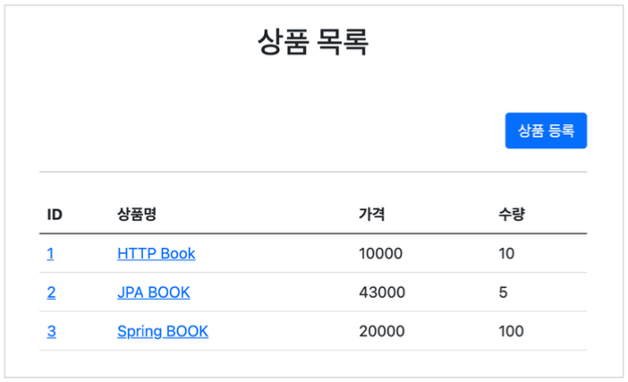
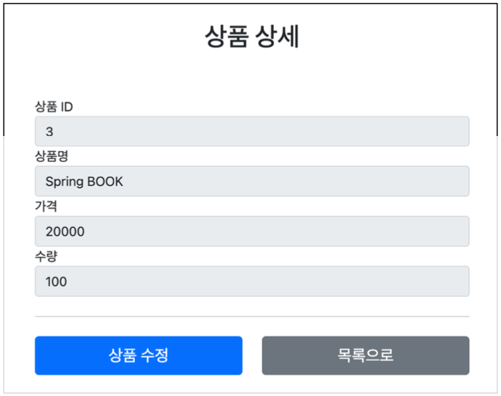
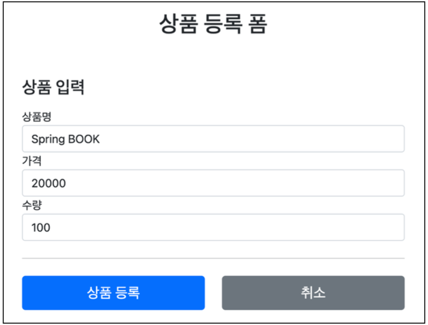
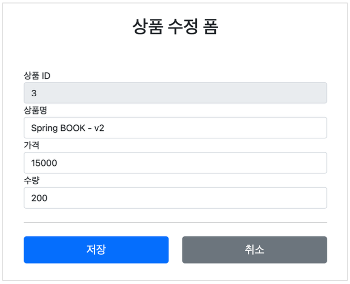

# Section 7. 스프링 MVC - 웹 페이지 만들기

## 요구사항 분석

### 상품 도메인 모델

- 상품 ID
- 상품명
- 가격
- 수량


### 상품 관리 기능

- 상품 목록
- 상품 상세
- 상품 등록
- 상품 수정


### 서비스 화면










### 서비스 제공 흐름


요구사항이 정리되고 디자이너, 웹 퍼블리셔, 백엔드 개발자가 업무를 나누어 진행한다.

- 디자이너: 요구사항에 맞도록 디자인하고, 디자인 결과물을 웹 퍼블리셔에게 넘겨준다.
- 웹 퍼블리셔: 디자이너에게 받은 디자인을 기반으로 HTML, CSS를 만들어 개발자에게 제공한다.
- 백엔드 개발자: 디자이너, 웹 퍼블리셔를 통해 HTML 화면이 나오기 전까지 시스템을 설계하고, 핵심 비즈니스 모델을 개발한다. 이후 HTML이 나오면 이 HTML을 뷰 템플릿으로 변환해서 동적으로 화면을 그리고 또 웹 화면의 흐름을 제어한다.


> [참고]
>
> React, Vue.js 같은 웹 클라이언트 기술을 사용하고, 웹 프론트엔드 개발자가 별도로 있으면, 웹 프론트엔드 개발자가 웹 퍼블리셔 역할까지 포함해서 하는 경우도 있다.
>
> 웹 클라이언트 기술을 사용하면, 웹 프론트엔드 개발자가 HTML을 동적으로 만드는 역할과 웹 화면의 흐름을 담당한다. 이 경우 백엔드 개발자는 HTML 뷰 템플릿을 직접 만지는 대신에 HTTP API를 통해 웹 클라이언트가 필요로 하는 데이터와 기능을 제공하면 된다.


## 상품 도메인 개발

### Item - 상품 객체

``` java
package hello.itemservice.domain.item;

import lombok.Data;

@Data
public class Item {

    private Long id;
    private String itemName;
    private Integer price;
    private Integer quantity;

    public Item() { }

    public Item(String itemName, Integer price, Integer quantity) {
        this.itemName = itemName;
        this.price = price;
        this.quantity = quantity;
    }
}
```


### ItemRepository - 상품 저장소

``` java
package hello.itemservice.domain.item;

import java.util.ArrayList;
import java.util.HashMap;
import java.util.List;
import java.util.Map;
import org.springframework.stereotype.Repository;

@Repository
public class ItemRepository {

    private static final Map<Long, Item> store = new HashMap<>();
    private static long sequence = 0L;

    public Item save(Item item) {
        item.setId(++sequence);
        store.put(item.getId(), item);
        return item;
    }

    public Item findById(Long id) {
        return store.get(id);
    }

    public List<Item> findAll() {
        // 한번 더 감싸서 새로운 객체로 리턴하는 것은 기존 store 에 영향을 주지 않기 위함이다.
        // 해당 메서드 호출해서 가져가서 다른 짓을 하게 되면 동일 주소를 참조하고 있기 떄문에...
        return new ArrayList<>(store.values());
    }

    public void update(Long itemId, Item updateParam) {
        Item findItem = findById(itemId);
        findItem.setItemName(updateParam.getItemName());
        findItem.setPrice(updateParam.getPrice());
        findItem.setQuantity(updateParam.getQuantity());
    }

    public void clearStore() {
        store.clear();
    }
}
```


### ItemRepositoryTest - 상품 저장소 테스트

``` java
package hello.itemservice.domain.item;

import static org.assertj.core.api.Assertions.assertThat;

import java.util.List;
import org.junit.jupiter.api.AfterEach;
import org.junit.jupiter.api.Test;

class ItemRepositoryTest {

    ItemRepository itemRepository = new ItemRepository();

    @AfterEach
    void afterEach() {
        itemRepository.clearStore();
    }

    @Test
    void save() {
        // given
        Item item = new Item("itemA", 10000, 10);

        // when
        Item savedItem = itemRepository.save(item);

        Item findItem = itemRepository.findById(item.getId());
        assertThat(findItem).isEqualTo(savedItem);
    }

    @Test
    void findAll() {
        // given
        Item item1 = new Item("item1", 10000, 10);
        Item item2 = new Item("item2", 20000, 20);

        itemRepository.save(item1);
        itemRepository.save(item2);

        // when
        List<Item> result = itemRepository.findAll();

        // then
        assertThat(result.size()).isEqualTo(2);
        assertThat(result).contains(item1, item2);
    }

    @Test
    void updateItem() {
        // given
        Item item = new Item("item1", 10000, 10);

        Item savedItem = itemRepository.save(item);
        Long itemId = savedItem.getId();

        // when
        Item updateParam = new Item("item2", 20000, 30);
        itemRepository.update(itemId, updateParam);

        Item findItem = itemRepository.findById(itemId);

        // then
        assertThat(findItem.getItemName()).isEqualTo(updateParam.getItemName());
        assertThat(findItem.getPrice()).isEqualTo(updateParam.getPrice());
        assertThat(findItem.getQuantity()).isEqualTo(updateParam.getQuantity());
    }
}
```


